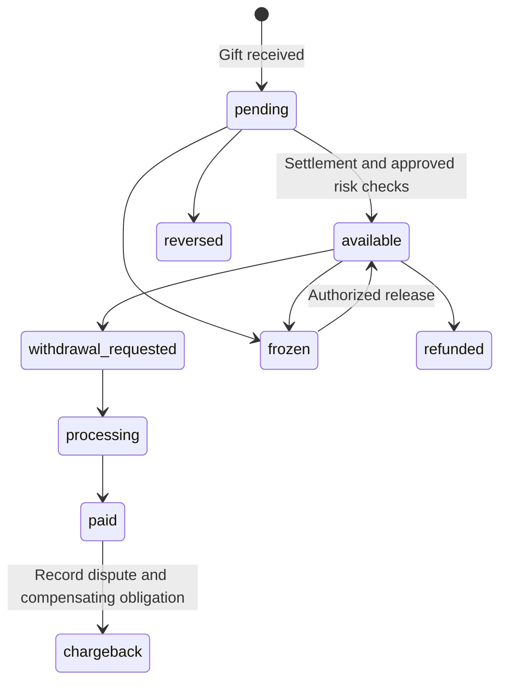

# Gift, balance and payout — PROPOSED / OPEN

This is the single design discussion source for financial requirements from the 2026-09-16 addendum. It is not a launched feature, audit finding, accounting recommendation or accepted ADR.

**CURRENT (static, `8092c1aa0a1ddfc15ec368c8f05a306fc2e9e993`):** no gift, wallet, ledger, payment webhook or withdrawal models exist in `apps/backend/prisma/schema.prisma`; no corresponding module is registered in `apps/backend/src/app.module.ts`. Searches of backend sources/package manifests found no payment implementation. `apps/frontend/features/legal/content/terms.ts` describes the service as free. These observations do not establish external provider activity or legal compliance.

**OPEN:** owners must first decide whether gifts/payouts enter the product, supported currencies, provider, financial ownership and settlement policy. The diagram below is a PROPOSED lifecycle, not the current schema or a complete provider-independent state machine.

`pending → available → withdrawal requested → processing → paid`, with `frozen`, `reversed`, `refunded`, `chargeback`, needs explicit allowed transitions, initiators, evidence and replay rules. A chargeback after payout cannot erase a completed external transfer; it creates a reconciliation/obligation case. Release timing, payout failure/retry, refund eligibility and negative-balance handling remain OPEN.

## Ledger and duplicate protection — TARGET if finance is approved

Money must not appear or disappear without an attributable financial record. A mutable `users.balance` must not be the sole source of truth. Evaluate an append-only journal in PostgreSQL with a reconciled derived balance; double-entry versus another rigorously reconciled model requires an explicit accounting/architecture decision.

Candidate operation types: `gift_purchase`, `gift_credit`, `fee`, `withdrawal`, `refund`, `chargeback`, `reversal`, `adjustment`, `hold`, `release`. Candidate fields: opaque transaction ID, account/user, type, exact amount and currency, status, creation/settlement time, external reference and scoped idempotency key. These are schema proposals, not existing columns. Amount representation and currency precision must be defined before implementation; do not use floating-point arithmetic for accounting.

Acceptance checks for a future implementation:

- Verify provider event authenticity, deduplicate provider event IDs with durable uniqueness, and bind a business idempotency key to its canonical payload. Replay returns the existing result; a changed payload with the same key is rejected.
- Atomically journal credit/debit and update any materialized balance under a defined concurrency policy. Concurrent spends/withdrawals cannot consume the same available funds twice.
- Treat the external payout and DB commit as separate failure boundaries: retries, unknown provider outcome and reconciliation must not create duplicate payouts. A DB transaction alone does not make a remote transfer atomic.
- Reconcile provider settlement, fees, refunds, chargebacks and internal journal; corrections use compensating entries and an audit trail.
- Verify duplicate/out-of-order webhooks, concurrent credits/withdrawals, crash/retry windows, locks and eventual settlement with synthetic data in an approved isolated environment. No such checks were run for this documentation task.

## Golden User: concentration and abuse — PROPOSED review scope

A popular recipient can concentrate financial exposure and technical load. Model payout concentration, liquidity, fraud/chargebacks alongside hot rows, hot keys, fan-out and notification storms. The technical capacity gate is owned by [Scaling Roadmap](./scaling-roadmap.md).

Record Top 1 user, Top 10 users and Top 1% payout shares; define time windows and denominators. Define cash-out ratio and gift inflow → payout ratio before comparing them. Stress scenarios should include cash-out at 20/40/60/80/100%, delayed settlement and concentrated refunds. Do not assume unwithdrawn balances are revenue or that users will fail to cash out.

The proposed contribution-margin worksheet accounts for gross gift inflow minus processing, refunds, chargebacks, fraud losses, payout processing, applicable taxes/fees, recipient payouts and infrastructure cost. Definitions must avoid double counting: an accounting owner must distinguish gross flow, revenue and liabilities. No commission, limit, reserve amount or payout timing is set here.

Threat scenario: stolen card → gifts → recipient balance → fast withdrawal → chargeback. Evaluate pending funds, settlement delay, holds, review, velocity controls and monitoring against that scenario. A queue or Redis does not prove financial consistency. Test thousands of competing operations only under a separately approved capacity scope.

## Owner decisions and separate review

- Product: gifts/payout scope, business semantics and customer promises.
- Finance/accounting: ledger model, reconciliation, liability/liquidity treatment and concentration limits.
- Security: provider authenticity, fraud response, authorization, replay and incident recovery.
- Legal/compliance: applicable jurisdictions and provider-specific KYC/AML/tax/payment obligations require qualified separate review. No legal obligations are inferred here.

An ADR follows a real choice and records alternatives, evidence and failure cases. None is accepted by this proposal.
