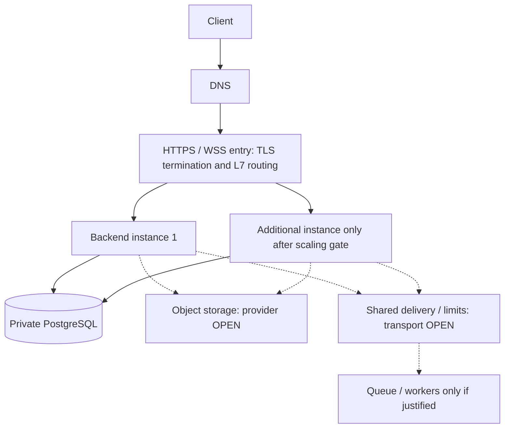
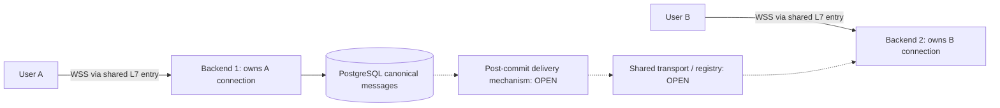

# Scaling Roadmap

Yuni should scale by strengthening the modular monolith first, then extracting only proven bottlenecks.

Microservices are not the current strategy.

Status review: 2026-09-16, code/config `8092c1aa0a1ddfc15ec368c8f05a306fc2e9e993`. **CURRENT** is the local single-instance modular monolith described in [Program Flow Map](./program-flow-map.md). Stages below are **TARGET** capabilities or **PROPOSED** technologies, not deployed infrastructure or an automatic implementation sequence. Individual provider/transport choices remain **OPEN**. See [evidence and integration scope](./integration-2026-09-16.md).

## Stage 1 - Modular Monolith

CURRENT local foundation; production readiness is TARGET.

- One Next.js frontend.
- One NestJS backend.
- PostgreSQL via Prisma migrations.
- Local Docker/PostgreSQL workflow.
- Shared docs and architecture conventions.
- Domain modules inside one backend process.

Goal: small team can ship MVP safely without distributed-system overhead.

## Stage 2 - Production-Ready Monolith

TARGET; reverse proxy product, TLS termination location and deployment platform are OPEN. CI checks/image publication already exist, but do not establish a running production deployment.

Before wider testing:

- Docker Compose server deployment;
- Nginx or equivalent reverse proxy;
- HTTPS;
- PostgreSQL backups and restore drills;
- CI/CD;
- logs and basic monitoring;
- error tracking;
- documented deploy and rollback steps.

Goal: one service boundary, but operationally reliable.

## Stage 3 - Object Storage / CDN for Media

TARGET capability; provider, upload mode and CDN are OPEN. No object-storage provider is CURRENT.

After the local `ProfilePhotoStorage` adapter MVP is stable:

- add an object-storage adapter behind the existing profile photo storage boundary;
- add CDN delivery;
- add signed/private media access where needed;
- move media metadata and visibility rules through backend;
- add production media moderation pipeline.

Goal: media storage no longer depends on one backend filesystem while preserving the existing public photo API contract.

## Stage 4 - Redis / Valkey

PROPOSED / NOT IMPLEMENTED. Selection requires the candidate record below.

Add only when there is a clear need:

- rate limit counters;
- short-lived cache;
- temporary state;
- idempotency or lock helpers if PostgreSQL alone is not enough.

Goal: support abuse prevention and hot-path temporary state without changing product module boundaries.

## Stage 5 - Workers / Queues

PROPOSED / NOT IMPLEMENTED. First measure synchronous workload and required retry/delivery guarantees.

Add for heavy or async work:

- media processing;
- EXIF/metadata stripping;
- thumbnails or blurhash generation;
- notifications;
- moderation jobs;
- retryable background tasks.

Goal: keep request/response endpoints fast while preserving the same source of truth in PostgreSQL.

## Stage 6 - Realtime Chat Layer

TARGET / NOT IMPLEMENTED. REST chat already exists; WSS transport is OPEN.

After basic chat API exists:

- WebSocket gateway;
- message delivery state;
- read receipts;
- typing/presence if needed;
- anti-spam controls.

Goal: realtime behavior without moving all chat domain logic out of the monolith too early.

## Stage 7 - Discovery Optimization

After discover API exists and real usage data appears:

- strong indexes;
- cursor pagination;
- block-aware filtering;
- caching for repeated queries;
- possible search engine later if PostgreSQL is not enough.

Goal: improve discover latency and abuse resistance based on measured bottlenecks.

## Stage 8 - Selective Service Extraction

Only extract a service when the monolith has a proven bottleneck or operational mismatch.

Possible candidates:

- media worker;
- chat realtime;
- notifications;
- recommendations;
- analytics.

Extraction rule:

- first define the boundary inside the modular monolith;
- measure the bottleneck;
- extract only the narrow component that benefits;
- keep shared security and data exposure rules documented.

## What Not To Do Now

- Do not start with microservices.
- Do not add Redis/event bus without a concrete use case.
- Do not build a complex recommendation system before discover basics.
- Do not build production CDN/media pipeline before local upload flow is stable.
- Do not add heavy admin tooling before basic reports/blocks exist.
- Do not optimize for huge traffic before indexes, pagination and auth/media/security foundations are solid.

## TARGET entry point and horizontal scaling

Start with one backend behind a reverse proxy before considering multiple replicas. A shared public L7 endpoint may route REST and WSS to the same backend pool. `/api/*` and `/ws/*` are **PROPOSED** edge paths only: current controllers do not use those prefixes, and WSS is absent. DNS/CDN/WAF products, balancing algorithm and replica count are OPEN.

The diagram is TARGET; optional dotted nodes are not dependencies of CURRENT. Object storage has its own API; provider-internal load balancing is outside Yuni ownership. PostgreSQL/Redis must never be exposed through the public application LB. A client-to-storage upload is an explicitly authorized media flow, not database access. Public/private network requirements live in [Security](../security/README.md).

Before replicas, demonstrate all of the following with a separate safe validation scope:

- Readiness removes unhealthy nodes; `HealthService` currently checks DB access, while liveness/readiness separation is OPEN.
- Draining stops new requests/upgrades and gives in-flight work a bounded finish window; define shutdown timeout and WSS reconnect behavior. `main.ts` does not configure graceful shutdown hooks; no readiness guarantee is inferred from a healthy local container.
- Session intent/revocation policy is consistent across nodes; JWT validation alone does not implement immediate access-token logout revocation. Use existing [owner decisions](../audits/yuni-2026-09/07-WAVE-1-FOLLOWUPS.md), not a new policy here.
- Uploaded bytes are no longer tied to one replica, and limits do not reset or multiply per node. `RateLimitService.buckets` is an in-process `Map`; two instances would have independent counters.
- DB pool budgets, indexes and transaction contention are measured. Additional backend nodes do not eliminate a single database or edge failure point; backup/restore, RTO/RPO, failover and edge redundancy remain OPEN acceptance criteria.

## TARGET media storage; upload strategy OPEN

Keep `ProfilePhotoStorage` as the adapter boundary. The CURRENT upload and static serving flow belongs to [Program Flow Map](./program-flow-map.md); do not treat a `storageKey` column as proof of S3.

| PROPOSED option | Applicability / tradeoff | Required evidence before selection |
| --- | --- | --- |
| Backend-proxied upload | Simpler authorization and byte validation; backend carries bandwidth | File limits, scan/sanitize path, retry/cleanup behavior and measured load |
| Presigned upload | Client sends bytes directly to a chosen provider; adds completion lifecycle | Backend-owned object namespace, bounded expiry, MIME/size constraints supported by provider, server-side completion verification and orphan cleanup |

TARGET storage is private by default; public serving is a separate owner decision. Metadata/ownership stays in PostgreSQL; file bytes go to the selected adapter. Add missing byte-size/status metadata only through an approved schema change. Signed access must expire and must not be logged. A presigned URL is a bearer capability and may remain usable until expiration; it is not a single-use authorization by default ([S3 documentation](https://docs.aws.amazon.com/AmazonS3/latest/userguide/using-presigned-url.html)). Cache/CDN TTL, revocation after block/delete and direct URL policy need DEC-003 resolution. No CDN or provider has been selected.

## WSS multi-instance delivery — PROPOSED / OPEN

CURRENT: REST controllers and persisted messages, no gateway or socket registry in `apps/backend/src`; dependencies do not contain Nest WebSocket/Socket.IO or Redis adapters. This is repository evidence, not inspection of external infrastructure.

A process owns its live socket; PostgreSQL owns durable history. Cross-node delivery requires an explicit transport/replay design; Redis Pub/Sub is one candidate, not a requirement or durable message log. Decide post-commit publication failure handling before claiming reliable delivery.

Verification must cover reconnect with a persisted cursor, duplicate suppression by event/message ID, conversation ordering, bounded outbound buffers/backpressure, slow clients, node failure and dropped events. Define how logout, revocation, block/unblock and membership changes invalidate live access. Sticky sessions cannot by themselves deliver an event between different nodes or recover history. Transport, event IDs, acknowledgement semantics and replay windows are OPEN; no delivery guarantee is CURRENT.

## Redis candidate gate — PROPOSED

No current Redis/cache/pubsub implementation was found. Do not add Redis to satisfy a diagram. Complete this record for each proposed use; unknown values block adoption rather than silently becoming defaults.

| Candidate | Problem / data | TTL | Source of truth | Failure / eviction behavior | Consistency model |
| --- | --- | --- | --- | --- | --- |
| Shared rate limiting | Independent process counters under replicas; scoped counters | Policy windows, not a global cache TTL | Approved limiter policy; DB remains authority for permissions | OPEN: deny/degrade policy and abuse limits during outage; eviction cannot silently reset limits | Atomic counter/window operations across nodes |
| Profile cache | Only if measured read latency warrants; minimal safe projections | OPEN, tied to freshness and privacy requirements | PostgreSQL | Bypass to authorized DB reads; no stale private data after visibility changes | Explicit invalidation, bounded staleness; policy OPEN |
| Realtime fan-out | Only if WSS spans nodes; events and temporary connection locations | OPEN retention/connection expiry | PostgreSQL history, each node owns its sockets | Replay from durable history or explicit loss handling; dropped Pub/Sub alone is not reliable delivery | Duplicate/order/replay contract OPEN |
| Security/session cache | Only after session policy approval; minimal revocation metadata | OPEN, bounded by token/session lifetime | PostgreSQL session state and owner policy | No silent fail-open authorization; eviction/outage rules need security review | Required revocation delay must be specified |

Redis is not a financial ledger, canonical history or substitute for database constraints. A PostgreSQL-only design remains a valid alternative where it meets measured needs.

## Orchestration and capacity decisions — OPEN

Kubernetes is **PROPOSED / NOT IMPLEMENTED** and optional. Local Docker Compose is CURRENT. Consider orchestration only when deploy frequency, availability needs and operator capacity justify its cost; compare a single managed host/Compose and a managed container platform before Kubernetes. Pods, Services and Ingress/Gateway are concepts, not existing Yuni resources.

Capacity review must use measured p95/p99 latency, connection counts, DB locks, memory and delivery lag. Popular profiles can cause hot PostgreSQL rows, hot cache keys (if introduced), queue partitions (if introduced), WSS/notification fan-out and cache invalidation storms. Candidates are bounded batching, aggregation, backpressure and background workers; adopt only against a measured bottleneck. Payment concentration and cash-out scenarios are specified separately in [Financial Flow](./financial-flow.md). No load experiment is authorized by this document.

Potential ADRs after decisions: deployment/TLS/trusted-proxy strategy; storage provider and upload mode; WSS transport; shared limiter/Redis introduction; identifier change (only if needed); financial ledger model. Record alternatives, failure behavior, acceptance checks and revisit triggers; do not create accepted ADRs while choices remain OPEN.
